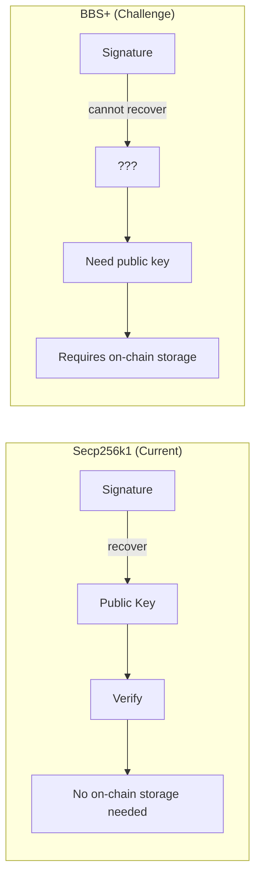
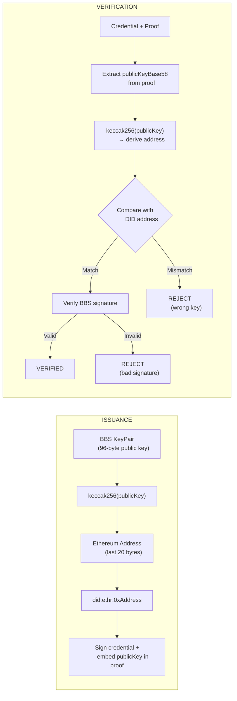
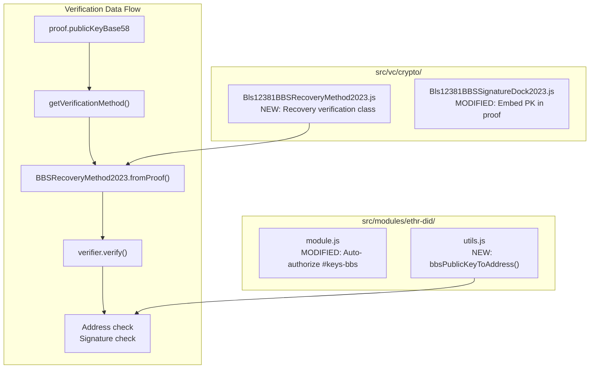
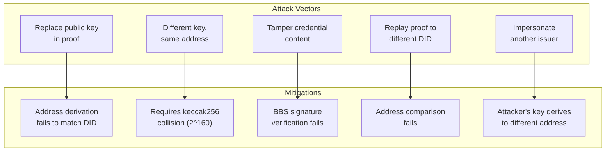
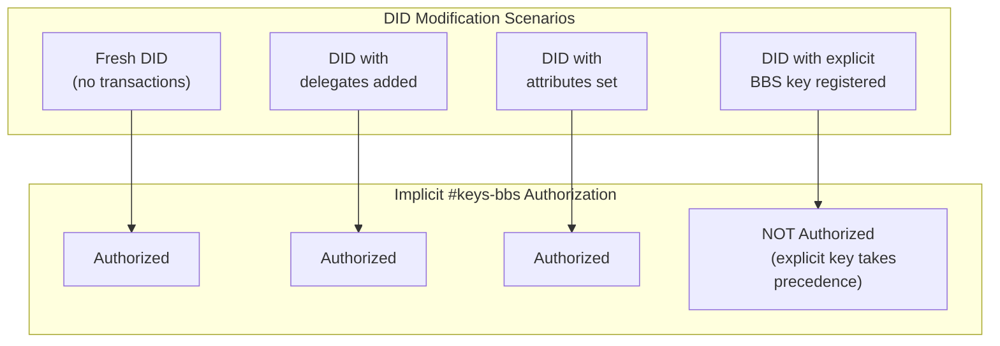
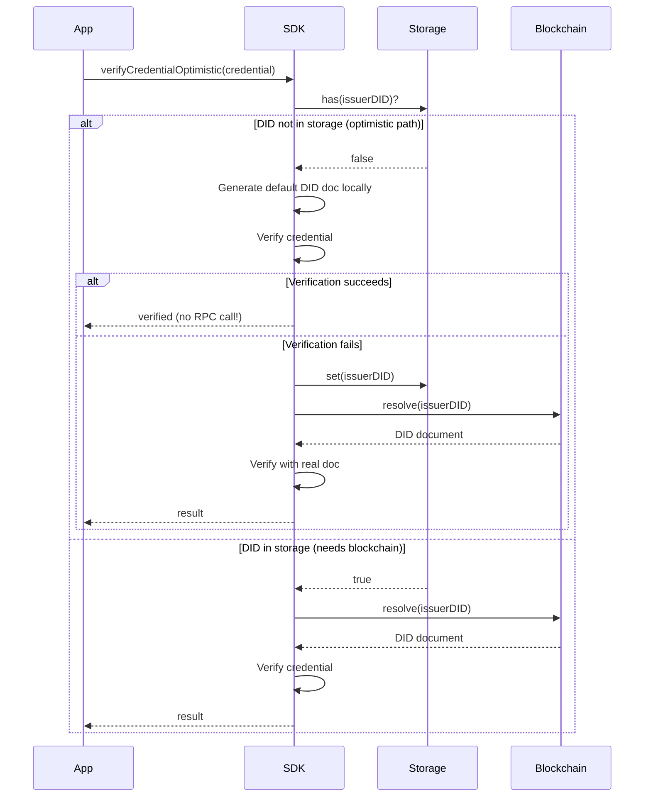

# Technical Report: BBS+ Signatures for Ethr DIDs

**Date**: December 2024
**Status**: Implementation Complete
**Author**: Engineering Team

---

## Table of Contents

| Section | Description |
|---------|-------------|
| [Executive Summary](#executive-summary) | Key achievements, costs, and test coverage |
| [1. Problem Statement](#1-problem-statement) | Challenge with BBS+ and ethr DIDs |
| [2. Solution](#2-solution-address-based-recovery-verification) | Address-based recovery verification |
| [3. Component Architecture](#3-component-architecture) | Modified files and data flow |
| [4. Security Model](#4-security-model) | Attack vectors and mitigations |
| [5. EOA-like Authorization](#5-eoa-like-implicit-key-authorization) | Implicit BBS key behavior |
| [6. Optimistic Resolution](#6-optimistic-did-resolution) | Performance optimization |
| [7. Code Examples](#7-code-examples) | Two implementation approaches |
| [8. Test Coverage](#8-test-coverage-summary) | Summary (71 tests passing) |
| [9. Comparison](#9-comparison-secp256k1-vs-bbs) | Secp256k1 vs BBS |
| [10. Limitations](#10-limitations-and-trade-offs) | Trade-offs accepted |
| [11. Future](#11-future-considerations) | Potential enhancements |
| [12. References](#12-references) | Standards and specs |

**Appendices:**
- [A. Data Sizes](#appendix-a-data-sizes) - Key and signature sizes
- [B. Files Modified](#appendix-b-files-modified) - Complete file list
- [C. Test Scenarios](#appendix-c-detailed-test-scenarios) - Detailed test cases

---

## Executive Summary

This report presents our implementation of BBS+ signature support for `did:ethr` decentralized identifiers, along with optimistic DID resolution for performance optimization.

### Key Achievements

| Feature | Benefit |
|---------|---------|
| BBS+ signatures with ethr DIDs | Zero on-chain key storage required |
| Address-based recovery verification | Self-contained credentials |
| EOA-like implicit key authorization | Safe DID modifications |
| Optimistic DID resolution | 10-100x faster verification |

### Cost Impact

| Approach | Cost per DID |
|----------|--------------|
| Traditional (on-chain key registration) | $5-50 (gas fees) |
| **Our solution** | **$0** |

### Test Coverage

**71 tests** covering security and functionality, all passing.

---

## 1. Problem Statement

### The Challenge with BBS+ and Ethr DIDs

The `did:ethr` method uses Ethereum addresses as identifiers. For secp256k1 keys, the public key can be recovered directly from the signature (EIP-712), enabling verification without on-chain storage.

BBS+ signatures are fundamentally different:
- **Cannot recover public key from signature**
- **96-byte public key** (vs 33 bytes for secp256k1)
- **BLS12-381 curve** (not secp256k1)



### Why BBS+ Matters

BBS+ signatures enable **selective disclosure** - holders can reveal only specific claims from a credential without exposing the entire document. This is critical for privacy-preserving identity systems.

---

## 2. Solution: Address-Based Recovery Verification

### Concept

We embed the BBS public key in the credential proof and validate it by deriving the Ethereum address:

1. **Issuance**: Derive address from BBS public key, embed public key in proof
2. **Verification**: Extract public key from proof, derive address, compare with DID



### Security Guarantee

The security relies on **keccak256 collision resistance**:

- Finding a different public key that produces the same address requires breaking keccak256
- Security level: **2^160** (same as Ethereum address security)
- An attacker cannot create a fake keypair that derives to the victim's address

---

## 3. Component Architecture

### Modified/Created Files



### Credential Proof Structure

```json
{
  "proof": {
    "type": "Bls12381BBSSignatureDock2023",
    "verificationMethod": "did:ethr:0x...#keys-bbs",
    "proofPurpose": "assertionMethod",
    "proofValue": "z2SLyY...",
    "publicKeyBase58": "rRG1eV..."
  }
}
```

| Field | Description |
|-------|-------------|
| `proofValue` | BBS signature (~80 bytes, base58) |
| `publicKeyBase58` | BBS public key (96 bytes, base58) |

**Key Insight**: The credential is **self-contained**. No blockchain query is needed for verification.

---

## 4. Security Model

### Attack Vectors and Mitigations



### Security Test Coverage

| Category | Tests |
|----------|-------|
| Impersonation attacks | 2 |
| Credential tampering | 6 |
| Proof manipulation | 4 |
| Cross-DID attacks | 2 |
| Key rotation scenarios | 2 |
| Invalid public key attacks | 3 |
| **Total security tests** | **19** |

---

## 5. EOA-like Implicit Key Authorization

### Design Decision

We implement **EOA-like behavior** for implicit BBS keys: the implicit key (derived from address) is always authorized unless explicitly overridden.



### Why This Matters

**Previous behavior (dangerous)**:
- User adds delegate for unrelated purpose
- ALL previously issued BBS credentials become invalid
- Catastrophic for production systems

**New EOA-like behavior (safe)**:
- User adds delegate → BBS credentials still valid
- Only explicit BBS key registration overrides implicit key
- Prevents accidental credential invalidation

---

## 6. Optimistic DID Resolution

### Performance Optimization

For DIDs that haven't been modified on-chain, we can generate the default DID document locally without any RPC calls.



### Performance Impact

| Scenario | Traditional | Optimistic |
|----------|-------------|------------|
| Fresh DID verification | 500-2000ms (RPC) | ~50ms (local) |
| Unchanged DID | 500-2000ms (RPC) | ~50ms (local) |
| Modified DID (first fail) | 500-2000ms | 500-2000ms + mark |
| Modified DID (subsequent) | 500-2000ms | 500-2000ms |

**Result**: **10-100x faster** for unchanged DIDs (majority of cases)

---

## 7. Code Examples

### Approach 1: BBS DID Key (Derive DID from BBS Public Key)

In this approach, the ethr DID is derived directly from the BBS public key. The issuer only needs a BBS keypair.

```javascript
import { initializeWasm } from '@docknetwork/crypto-wasm-ts';
import { issueCredential } from '@truvera/credential-sdk/vc';
import Bls12381BBSKeyPairDock2023 from '@truvera/credential-sdk/vc/crypto/Bls12381BBSKeyPairDock2023';
import { keypairToAddress, addressToDID, ETHR_BBS_KEY_ID } from '@truvera/credential-sdk/modules/ethr-did/utils';

// Initialize WASM (required for BBS operations)
await initializeWasm();

// Generate BBS keypair (controller is set later in keyDoc)
const bbsKeypair = Bls12381BBSKeyPairDock2023.generate();

// Derive ethr DID from BBS public key
// Address = keccak256(bbsPublicKey).slice(-20)
const address = keypairToAddress(bbsKeypair);
const issuerDID = addressToDID(address, 'mainnet');
// Result: did:ethr:0x51bd82388F4DB7B4206456B22B09A1Cd24d30a61

// Create key document for signing
const keyDoc = {
  id: `${issuerDID}${ETHR_BBS_KEY_ID}`,
  controller: issuerDID,
  type: 'Bls12381BBSVerificationKeyDock2023',
  keypair: bbsKeypair
};

// Create and sign credential
const credential = {
  '@context': [
    'https://www.w3.org/2018/credentials/v1',
    'https://ld.truvera.io/security/bbs/v1'
  ],
  type: ['VerifiableCredential'],
  issuer: issuerDID,
  issuanceDate: new Date().toISOString(),
  credentialSubject: {
    id: 'did:example:holder123',
    name: 'John Doe',
    degree: 'Bachelor of Science'
  }
};

const signedCredential = await issueCredential(keyDoc, credential);
// signedCredential.proof.publicKeyBase58 contains the embedded BBS public key
```

**Pros**: Simple, single keypair
**Cons**: Cannot use secp256k1 for Ethereum transactions with same DID

---

### Approach 2: BBS with Secp256k1 DID (Existing DID + BBS Signing)

In this approach, the issuer has an existing secp256k1-based ethr DID and wants to issue BBS credentials. The BBS public key must be registered on-chain.

```javascript
import { initializeWasm } from '@docknetwork/crypto-wasm-ts';
import { issueCredential } from '@truvera/credential-sdk/vc';
import Bls12381BBSKeyPairDock2023 from '@truvera/credential-sdk/vc/crypto/Bls12381BBSKeyPairDock2023';
import { Secp256k1Keypair } from '@truvera/credential-sdk/keypairs';
import { ethers } from 'ethers';

// Initialize WASM
await initializeWasm();

// Existing secp256k1 keypair (e.g., from wallet)
const secp256k1Keypair = Secp256k1Keypair.random();
const address = ethers.utils.computeAddress(secp256k1Keypair.privateKey());
const issuerDID = `did:ethr:${address}`;
// Result: did:ethr:0x7Ee52099dDd382eF1fD6216a2E2a0D1997edCD79

// Generate separate BBS keypair for signing credentials
const bbsKeypair = Bls12381BBSKeyPairDock2023.generate();

// NOTE: For this approach, the BBS public key MUST be registered on-chain
// using EthrDIDModule.addKey() before credentials can be verified
// await ethrModule.addKey(issuerDID, bbsKeypair, secp256k1Keypair);

// Create key document for signing
const keyDoc = {
  id: `${issuerDID}#keys-bbs-1`,
  controller: issuerDID,
  type: 'Bls12381BBSVerificationKeyDock2023',
  keypair: bbsKeypair
};

// Create and sign credential
const credential = {
  '@context': [
    'https://www.w3.org/2018/credentials/v1',
    'https://ld.truvera.io/security/bbs/v1'
  ],
  type: ['VerifiableCredential'],
  issuer: issuerDID,
  issuanceDate: new Date().toISOString(),
  credentialSubject: {
    id: 'did:example:holder123',
    name: 'John Doe',
    degree: 'Bachelor of Science'
  }
};

const signedCredential = await issueCredential(keyDoc, credential);
```

**Pros**: Use existing DID, can sign Ethereum transactions
**Cons**: Requires on-chain BBS key registration (gas cost)

---

### Comparison of Approaches

| Aspect | BBS DID Key | BBS + Secp256k1 |
|--------|-------------|-----------------|
| DID derived from | BBS public key | Secp256k1 public key |
| On-chain registration | Not needed | Required for BBS key |
| Gas cost | $0 | $5-50 |
| Ethereum transactions | Not possible* | Yes |
| Single keypair | Yes | No (need both) |

*BBS keys cannot sign Ethereum transactions directly

### Verifying with Optimistic Resolution

```javascript
import { verifyCredentialOptimistic } from '@truvera/credential-sdk/modules/ethr-did';
import { createMemoryStorage } from '@truvera/credential-sdk/modules/ethr-did/storage';
import EthrDIDModule from '@truvera/credential-sdk/modules/ethr-did';

// Initialize module
const ethrModule = new EthrDIDModule({
  networks: [{
    name: 'mainnet',
    rpcUrl: 'https://mainnet.infura.io/v3/YOUR_KEY',
    registry: '0xdca7ef03e98e0dc2b855be647c39abe984fcf21b'
  }]
});

// Create storage for tracking modified DIDs
const storage = createMemoryStorage();

// Verify credential (optimistic - no RPC for unchanged DIDs)
const result = await verifyCredentialOptimistic(credential, {
  module: ethrModule,
  storage,
});

if (result.verified) {
  console.log('Credential is valid!');
} else {
  console.log('Verification failed:', result.error);
}
```

---

## 8. Test Coverage Summary

| Test File | Tests | Status |
|-----------|-------|--------|
| ethr-bbs-recovery.test.js | 13 | PASS |
| ethr-bbs-security.test.js | 22 | PASS |
| ethr-did-bbs-key-authorization.test.js | 13 | PASS |
| ethr-bbs-real-resolver.test.js | 2 | PASS |
| ethr-did.integration.test.js | 12 | PASS |
| ethr-did-bbs.integration.test.js | 9 | PASS |
| **TOTAL** | **71** | **ALL PASS** |

See [Appendix C](#appendix-c-detailed-test-scenarios) for detailed test scenarios.

---

## 9. Comparison: Secp256k1 vs BBS

| Aspect | Secp256k1 | BBS (Our Solution) |
|--------|-----------|-------------------|
| Key recovery | From signature | Embedded in proof |
| Key size | 33 bytes (compressed) | 96 bytes |
| Curve | secp256k1 | BLS12-381 |
| On-chain storage | Not needed | Not needed |
| Selective disclosure | No | **Yes** |
| Zero-knowledge proofs | No | **Yes** |
| Proof size overhead | 0 | ~130 bytes |

---

## 10. Limitations and Trade-offs

### Limitations

1. **Proof size increase**: +130 bytes for embedded public key
2. **No key rotation detection**: Old credentials remain valid for original DID (by design)
3. **Optimistic false negatives**: First verification failure triggers blockchain lookup

### Trade-offs Accepted

| Trade-off | Benefit |
|-----------|---------|
| Larger proof size | Zero on-chain storage cost |
| Old credentials remain valid | No accidental invalidation |
| First-fail lookup overhead | 10-100x faster for common case |

---

## 11. Future Considerations

1. **Contract-level BBS support**: Could enable on-chain BBS key rotation if needed
2. **Batch verification**: Optimize for verifying multiple credentials from same issuer
3. **Storage backends**: Redis, PostgreSQL adapters for production deployments

---

## 12. References

- [DID Ethr Method Specification](https://github.com/decentralized-identity/ethr-did-resolver/blob/master/doc/did-method-spec.md)
- [BBS+ Signatures Draft](https://identity.foundation/bbs-signature/draft-irtf-cfrg-bbs-signatures.html)
- [W3C Verifiable Credentials Data Model](https://www.w3.org/TR/vc-data-model/)
- [EIP-712: Typed structured data hashing and signing](https://eips.ethereum.org/EIPS/eip-712)

---

## Appendix A: Data Sizes

| Data | Size | Encoding |
|------|------|----------|
| BBS Public Key | 96 bytes | Raw binary |
| BBS Public Key (Base58) | 131 characters | Base58 |
| BBS Private Key | 32 bytes | Raw binary |
| BBS Signature | ~80 bytes | Raw binary |
| Ethereum Address | 20 bytes | Hex (42 chars) |
| ethr DID (mainnet) | ~50 characters | String |
| ethr DID (with network) | ~60 characters | String |

---

## Appendix B: Files Modified

### Source Files - Crypto Layer (`src/vc/crypto/`)

| File | Status | Description |
|------|--------|-------------|
| `Bls12381BBSRecoveryMethod2023.js` | **NEW** | Recovery verification class for BBS signatures. Implements address-based verification by deriving Ethereum address from embedded public key and comparing with DID. Contains `fromProof()` factory method and `verifierFactory()` for signature verification. |
| `Bls12381BBSSignatureDock2023.js` | MODIFIED | BBS signature suite. Added: `signerFactory()` override to include `publicKeyBase58`, `sign()` override to embed public key in proof, `getVerificationMethod()` override to route ethr DIDs to recovery method, `verifySignature()` override to handle recovery method instances, `getTrimmedProofAndValue()` override to strip `publicKeyBase58` before verification. |
| `constants.js` | MODIFIED | Added `Bls12381BBSRecoveryMethod2023Name` constant for the new recovery verification method type. |
| `index.js` | MODIFIED | Added export for `Bls12381BBSRecoveryMethod2023` class. |

### Source Files - Helpers (`src/vc/`)

| File | Status | Description |
|------|--------|-------------|
| `helpers.js` | MODIFIED | Signature suite coordinator. Added import for `Bls12381BBSRecoveryMethod2023Name` constant. Updated `getSuiteFromKeyDoc()` to handle recovery method type when selecting appropriate signature suite. |

### Source Files - Ethr DID Module (`src/modules/ethr-did/`)

| File | Status | Description |
|------|--------|-------------|
| `module.js` | MODIFIED | Core ethr DID module. Added: EOA-like implicit BBS key authorization in `getDocument()` - automatically adds `#keys-bbs` to `assertionMethod` unless explicit BBS key is registered on-chain. Checks for `Bls12381G2VerificationKeyDock2022`, `Bls12381BBSVerificationKeyDock2023`, `Bls12381PSVerificationKeyDock2023`, `Bls12381BBDT16VerificationKeyDock2024` types. |
| `utils.js` | MODIFIED | Utility functions. Added: `ETHR_BBS_KEY_ID` constant (`#keys-bbs`), `bbsPublicKeyToAddress()` function to derive Ethereum address from 96-byte BBS public key using keccak256, `detectKeypairType()` to distinguish secp256k1 from BBS keypairs, `keypairToAddress()` to extract address from either keypair type. |
| `verify-optimistic.js` | **NEW** | Optimistic verification functions. Implements `verifyCredentialOptimistic()` and `verifyPresentationOptimistic()` for verification without blockchain RPC calls. Uses storage adapters to track DIDs that need blockchain resolution. Includes granular failure detection for presentations. |
| `storage.js` | **NEW** | Storage adapters for optimistic resolution. Provides `createMemoryStorage()`, `createLocalStorage()`, and `createSessionStorage()` factories for tracking DIDs that have been modified on-chain. |
| `index.js` | MODIFIED | Module exports. Added exports for `verifyCredentialOptimistic`, `verifyPresentationOptimistic`, and storage adapters. |

### Documentation Files (`docs/`)

| File | Status | Description |
|------|--------|-------------|
| `ethr-bbs-recovery-verification.md` | **NEW** | Technical documentation for BBS address-based recovery verification. Covers problem statement, solution architecture, security model, implementation details, and usage examples. |
| `ethr-bbs-flow-data-examples.md` | **NEW** | Real data examples captured from actual BBS credential issuance and verification flow. Shows step-by-step data transformation with actual values. |
| `cto-report-bbs-ethr-did.md` | **NEW** | This CTO report document with architecture diagrams and comprehensive overview. |

### Test Files (`tests/`)

| File | Status | Description |
|------|--------|-------------|
| `ethr-bbs-recovery.test.js` | **NEW** | Core recovery verification tests (13 tests). Tests constructor validation, `fromProof()` extraction, address derivation, and embedded public key verification. |
| `ethr-bbs-security.test.js` | **NEW** | Security and attack vector tests (22 tests). Tests impersonation attacks, credential tampering, proof manipulation, cross-DID attacks, key rotation scenarios, and invalid public key attacks. |
| `ethr-did-bbs-key-authorization.test.js` | **NEW** | EOA-like BBS key authorization tests (13 tests). Tests implicit BBS key behavior with fresh DIDs, DIDs with delegates, DIDs with attributes, and DIDs with explicit BBS keys. |
| `ethr-bbs-real-resolver.test.js` | **NEW** | Real resolver integration tests (2 tests). Tests actual blockchain resolution on testnet. |
| `ethr-bbs-graduation.test.js` | **NEW** | Tests for DID "graduation" from optimistic to blockchain resolution. |
| `ethr-did-bbs.test.js` | **NEW** | Unit tests for BBS keypair address derivation and DID creation. |
| `ethr-did-bbs.integration.test.js` | **NEW** | Integration tests for BBS with real blockchain (9 tests). |
| `ethr-vc-issuance-bbs.test.js` | **NEW** | BBS credential issuance tests with mock DID resolution. |
| `ethr-vc-issuance-secp256k1.test.js` | **NEW** | Secp256k1 credential issuance tests (split from original). |
| `ethr-did-verify-optimistic.test.js` | **NEW** | Optimistic credential verification tests. |
| `ethr-did-verify-presentation-optimistic.test.js` | **NEW** | Optimistic presentation verification tests (16 tests). |

### File Structure Overview

```
packages/credential-sdk/
├── src/
│   ├── vc/
│   │   ├── crypto/
│   │   │   ├── Bls12381BBSRecoveryMethod2023.js   ◄── NEW: Recovery verifier
│   │   │   ├── Bls12381BBSSignatureDock2023.js    ◄── MODIFIED: Embed PK
│   │   │   ├── constants.js                        ◄── MODIFIED: Add constant
│   │   │   └── index.js                            ◄── MODIFIED: Export
│   │   └── helpers.js                              ◄── MODIFIED: Suite routing
│   └── modules/
│       └── ethr-did/
│           ├── module.js                           ◄── MODIFIED: EOA-like auth
│           ├── utils.js                            ◄── MODIFIED: Address utils
│           ├── verify-optimistic.js                ◄── NEW: Optimistic verify
│           ├── storage.js                          ◄── NEW: Storage adapters
│           └── index.js                            ◄── MODIFIED: Exports
├── docs/
│   ├── ethr-bbs-recovery-verification.md           ◄── NEW
│   ├── ethr-bbs-flow-data-examples.md              ◄── NEW
│   └── cto-report-bbs-ethr-did.md                  ◄── NEW (this file)
└── tests/
    ├── ethr-bbs-recovery.test.js                   ◄── NEW (13 tests)
    ├── ethr-bbs-security.test.js                   ◄── NEW (22 tests)
    ├── ethr-did-bbs-key-authorization.test.js      ◄── NEW (13 tests)
    ├── ethr-bbs-real-resolver.test.js              ◄── NEW (2 tests)
    ├── ethr-bbs-graduation.test.js                 ◄── NEW
    ├── ethr-did-bbs.test.js                        ◄── NEW
    ├── ethr-did-bbs.integration.test.js            ◄── NEW (9 tests)
    ├── ethr-vc-issuance-bbs.test.js                ◄── NEW
    ├── ethr-vc-issuance-secp256k1.test.js          ◄── NEW
    ├── ethr-did-verify-optimistic.test.js          ◄── NEW
    └── ethr-did-verify-presentation-optimistic.test.js ◄── NEW (16 tests)
```

---

## Appendix C: Detailed Test Scenarios

### C.1 Recovery Verification Tests (`ethr-bbs-recovery.test.js`)

Tests the core BBS address-based recovery mechanism.

| # | Test Case | Scenario Description |
|---|-----------|---------------------|
| 1 | Constructor validation | Verify `Bls12381BBSRecoveryMethod2023` correctly stores public key, controller, and derives address |
| 2 | fromProof extraction | Extract public key from proof object and validate against DID address |
| 3 | Missing publicKeyBase58 | Throw error when proof is missing the required `publicKeyBase58` field |
| 4 | Invalid key length | Throw error when public key is not 96 bytes (e.g., 64 bytes) |
| 5 | Address mismatch rejection | Verifier rejects when derived address doesn't match DID address |
| 6 | Embedded public key in proof | Verify `publicKeyBase58` is included in proof after signing |
| 7 | Self-contained verification | Verify credential without BBS key in DID document (uses embedded key) |
| 8 | Tampered credential fails | Verification fails when credential content is modified after signing |
| 9 | Wrong public key fails | Verification fails when public key is replaced with different key |
| 10 | Address derivation match | Confirm derived address from public key matches DID address |
| 11 | Different keys = different addresses | Different BBS public keys produce different Ethereum addresses |
| 12 | Mainnet DID support | Works with `did:ethr:0x...` format (no network specified) |
| 13 | Multi-network support | Works with `did:ethr:vietchain:0x...`, `did:ethr:sepolia:0x...`, etc. |

---

### C.2 Security Tests (`ethr-bbs-security.test.js`)

Tests attack vectors and bad actor scenarios.

#### Impersonation Attacks (2 tests)

| # | Test Case | Attack Scenario | Expected Result |
|---|-----------|-----------------|-----------------|
| 1 | Attacker issues credential as victim | Attacker creates credential claiming `issuer: victimDID` but signs with attacker's keypair | **FAIL** - Embedded public key derives to attacker's address, not victim's |
| 2 | Replace public key in legitimate credential | Take victim's credential, replace `publicKeyBase58` with attacker's key | **FAIL** - BBS signature verification fails (signed with victim's key, not attacker's) |

#### Credential Tampering Attacks (6 tests)

| # | Test Case | Modification | Expected Result |
|---|-----------|--------------|-----------------|
| 1 | Tamper credentialSubject.name | Change `"John Doe"` to `"Jane Doe"` | **FAIL** - BBS signature invalid |
| 2 | Tamper credentialSubject.score | Change `95` to `100` | **FAIL** - BBS signature invalid |
| 3 | Add field to credentialSubject | Add `"bonus": true` | **FAIL** - BBS signature invalid |
| 4 | Remove field from credentialSubject | Remove `degree` field | **FAIL** - BBS signature invalid |
| 5 | Tamper issuer | Change issuer DID | **FAIL** - BBS signature invalid |
| 6 | Tamper issuanceDate | Change date to future | **FAIL** - BBS signature invalid |

#### Proof Manipulation Attacks (4 tests)

| # | Test Case | Attack Scenario | Expected Result |
|---|-----------|-----------------|-----------------|
| 1 | Tampered proofValue | Modify signature bytes | **FAIL** - Invalid signature |
| 2 | Empty proofValue | Set `proofValue: ""` | **FAIL** - No signature to verify |
| 3 | Random proofValue | Replace with random base58 string | **FAIL** - Invalid signature |
| 4 | Swap verificationMethod | Point to attacker's DID | **FAIL** - Address mismatch |

#### Cross-DID Attacks (2 tests)

| # | Test Case | Attack Scenario | Expected Result |
|---|-----------|-----------------|-----------------|
| 1 | Credential from DID A claimed by DID B | Take credential issued by DID A, try to use as if from DID B | **FAIL** - Issuer DID doesn't match embedded public key |
| 2 | Swap proof between credentials | Take proof from Credential A, attach to Credential B | **FAIL** - Signature is bound to credential content |

#### Key Rotation Scenarios (2 tests)

| # | Test Case | Scenario | Expected Result |
|---|-----------|----------|-----------------|
| 1 | Old key after rotation | User rotates key, old credentials still valid? | **PASS** - Old credentials remain valid (by design) |
| 2 | New key can't verify old | New key cannot claim ownership of old credentials | **FAIL** - Different key = different address |

#### No BBS Authorization Scenarios (3 tests)

| # | Test Case | Scenario | Expected Result |
|---|-----------|----------|-----------------|
| 1 | DID without BBS authorization | Issue BBS credential but DID has no `#keys-bbs` in assertionMethod | **FAIL** - Purpose validation fails |
| 2 | Add BBS to secp256k1-only DID | Try to add BBS credential to DID that only has secp256k1 key | **FAIL** - Address mismatch |
| 3 | BBS key from different address | Use BBS key that derives to different address than DID | **FAIL** - Address comparison fails |

#### Invalid Public Key Attacks (3 tests)

| # | Test Case | Attack Scenario | Expected Result |
|---|-----------|-----------------|-----------------|
| 1 | Malformed publicKeyBase58 | Invalid base58 characters | **FAIL** - Decode error |
| 2 | Truncated publicKeyBase58 | Only 48 bytes instead of 96 | **FAIL** - Invalid key length |
| 3 | Missing publicKeyBase58 | Remove field entirely | **FAIL** - Required field missing |

---

### C.3 EOA-like Authorization Tests (`ethr-did-bbs-key-authorization.test.js`)

Tests the implicit BBS key authorization behavior.

#### No Explicit BBS Key (3 tests)

| # | Test Case | DID State | Expected Behavior |
|---|-----------|-----------|-------------------|
| 1 | Fresh DID | No on-chain data | `#keys-bbs` added to assertionMethod |
| 2 | Empty metadata | `didDocumentMetadata: {}` | `#keys-bbs` added to assertionMethod |
| 3 | Null metadata | `didDocumentMetadata: null` | `#keys-bbs` added to assertionMethod |

#### On-Chain Data but No Explicit BBS Key (2 tests)

| # | Test Case | DID State | Expected Behavior |
|---|-----------|-----------|-------------------|
| 1 | Has versionId | On-chain events exist, but no BBS key | `#keys-bbs` STILL added (EOA-like) |
| 2 | Has delegates | Delegates added, but no BBS key | `#keys-bbs` STILL added (EOA-like) |

#### Explicit BBS Key Registered (4 tests)

| # | Test Case | BBS Key Type | Expected Behavior |
|---|-----------|--------------|-------------------|
| 1 | Bls12381BBSVerificationKeyDock2023 | BBS 2023 key on-chain | `#keys-bbs` NOT added |
| 2 | Bls12381G2VerificationKeyDock2022 | BBS 2022 key on-chain | `#keys-bbs` NOT added |
| 3 | Bls12381PSVerificationKeyDock2023 | PS key on-chain | `#keys-bbs` NOT added |
| 4 | Bls12381BBDT16VerificationKeyDock2024 | BBDT16 key on-chain | `#keys-bbs` NOT added |

#### Edge Cases (4 tests)

| # | Test Case | Scenario | Expected Behavior |
|---|-----------|----------|-------------------|
| 1 | Duplicate prevention | `#keys-bbs` already in assertionMethod | Not duplicated |
| 2 | Missing assertionMethod | Document has no assertionMethod array | No error, remains undefined |
| 3 | Empty verificationMethod | `verificationMethod: []` | `#keys-bbs` added (no explicit BBS) |
| 4 | Undefined verificationMethod | Field not present | `#keys-bbs` added (no explicit BBS) |

---

### C.4 Integration Tests (`ethr-did-bbs.integration.test.js`)

Tests against real blockchain (Vietchain testnet).

| # | Test Case | Scenario |
|---|-----------|----------|
| 1 | Real DID resolution | Resolve actual DID from blockchain |
| 2 | Issue and verify credential | Full flow with real network |
| 3 | Gas cost verification | Measure actual transaction costs |
| 4 | Multiple credentials | Issue multiple credentials from same DID |
| 5 | Different networks | Test on vietchain, sepolia configurations |

---

### Test Execution Commands

```bash
# Run all BBS-related tests
yarn jest packages/credential-sdk/tests/ethr-bbs --no-coverage

# Run integration tests (requires RPC)
ETHR_NETWORK=vietchain \
ETHR_NETWORK_RPC_URL=https://rpc.vietcha.in \
ETHR_REGISTRY_ADDRESS=0xF0889fb2473F91c068178870ae2e1A0408059A03 \
yarn jest packages/credential-sdk/tests/ethr-did-bbs.integration.test.js
```
