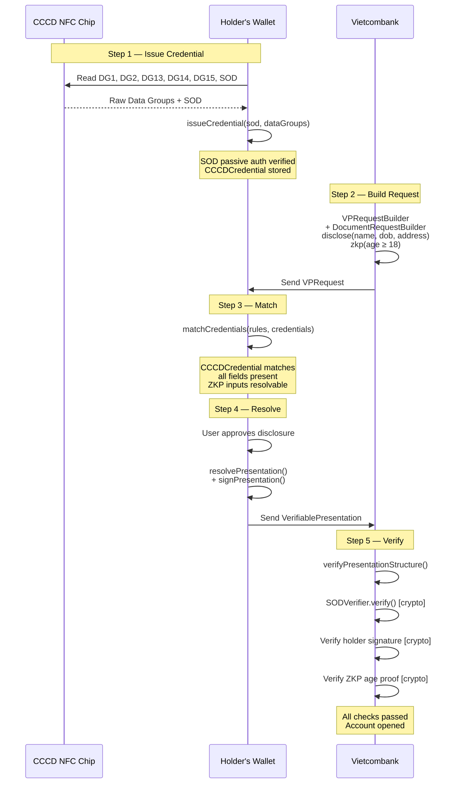
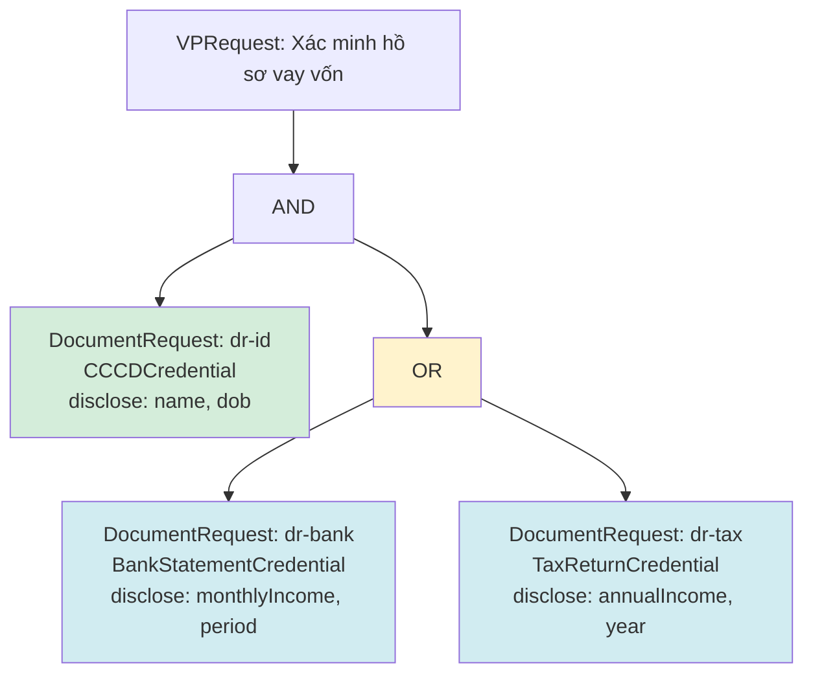

# Use Case: CCCD Identity Verification via Presentation Exchange

Real-world scenario — a Vietnamese bank verifies a customer's identity using their CCCD (Căn Cước Công Dân) chip data, with selective disclosure and an age proof via ZKP.

---

## Scenario

> **Vietcombank** needs to verify a customer opening an account online.
> They request: full name, date of birth, permanent address, and a ZKP proving age ≥ 18.
> The customer's wallet holds a `CCCDCredential` issued from the NFC chip.

---

## Step 1 — Issue the CCCD Credential (credential-sdk)

The wallet reads the CCCD chip via NFC and issues a VerifiableCredential:

```typescript
import { issueCredential } from '@1matrix/credential-sdk/icao/credentials/cccd';

// Raw data read from CCCD NFC chip (base64-encoded Data Groups)
const rawDataGroups = {
  dg1:  'YFkBCl8fMQAYVk5NMDc4MDk0MDA1MDE2PDw8PDw8PDw8OTkwMTAx...',
  dg2:  '/9j/4AAQSkZJRgABAQAAAQABAAD/2wBDAAgGBgcGBQgHBwcJCQ...',
  dg13: 'bYIBi...',   // Vietnamese proprietary TLV: name, address, etc.
  dg14: 'MIIBkz...',  // Security info
  dg15: 'MIIBIj...',  // Active Authentication public key
  com:  'YIGgAQ...',  // Common data
};

// SOD = CMS/PKCS#7 signed hash of all DGs (read from chip EF.SOD)
const sodBase64 = 'MIIHqQYJKoZIhvcNAQcCoIIHmj...';

const credential = await issueCredential(sodBase64, rawDataGroups);
```

The resulting credential stored in the wallet:

```json
{
  "@context": [
    "https://www.w3.org/ns/credentials/v2",
    "https://cccd.gov.vn/credentials/v1"
  ],
  "type": ["VerifiableCredential", "CCCDCredential"],
  "issuer": "did:web:cccd.gov.vn",
  "credentialSubject": {
    "id": "did:vbsn:cccd:MIIBIj...",
    "dg1":  "YFkBCl8fMQAYVk5NMDc4MDk0MDA1MDE2PDw8PDw8PDw8OTkwMTAx...",
    "dg2":  "/9j/4AAQSkZJRgABAQAAAQABAAD...",
    "dg13": "bYIBi...",
    "dg14": "MIIBkz...",
    "dg15": "MIIBIj...",
    "com":  "YIGgAQ..."
  },
  "credentialSchema": {
    "id": "https://cccd.gov.vn/schemas/cccd/1.0.0",
    "type": "JsonSchema"
  },
  "proof": {
    "type": "ICAO9303SODSignature",
    "dgProfile": "VN-CCCD-2024",
    "proofPurpose": "assertionMethod",
    "created": "2026-03-05T10:30:00Z",
    "sod": "MIIHqQYJKoZIhvcNAQcCoIIHmj...",
    "dsCertificate": "MIICpTCCAYkCFH..."
  }
}
```

---

## Step 2 — Build VPRequest (Verifier: Vietcombank)

Vietcombank builds a request using `presentation-exchange`:

```typescript
import {
  VPRequestBuilder,
  DocumentRequestBuilder,
} from '@1matrix/presentation-exchange';

const request = new VPRequestBuilder('vcb-kyc-001')
  .setVersion('1.0')
  .setName('Xác minh danh tính mở tài khoản')
  .setVerifier({
    id: 'did:web:vietcombank.com.vn',
    name: 'Vietcombank',
    url: 'https://ekyc.vietcombank.com.vn',
  })
  .setExpiresAt('2026-03-05T11:00:00Z')
  .addDocumentRequest(
    new DocumentRequestBuilder('dr-cccd', 'CCCDCredential')
      .setIssuer('did:web:cccd.gov.vn')
      .setPurpose('Xác minh danh tính để mở tài khoản ngân hàng')

      // Request specific fields
      .disclose('c-name', '$.credentialSubject.dg13', {
        purpose: 'Họ và tên',
      })
      .disclose('c-dob', '$.credentialSubject.dg1', {
        purpose: 'Ngày sinh',
      })
      .disclose('c-address', '$.credentialSubject.dg13', {
        purpose: 'Địa chỉ thường trú',
      })
      .disclose('c-photo', '$.credentialSubject.dg2', {
        purpose: 'Ảnh chân dung',
        optional: true,
      })

      // ZKP: prove age ≥ 18 without revealing exact DOB
      .zkp('zkp-age-18', {
        circuitId: 'age-gte',
        proofSystem: 'groth16',
        privateInputs: {
          dateOfBirth: '$.credentialSubject.dg1',
        },
        publicInputs: {
          minAge: 18,
          currentDate: '2026-03-05',
        },
        purpose: 'Chứng minh đủ 18 tuổi',
      })
      .build(),
  )
  .build();
```

The built request object:

```json
{
  "id": "vcb-kyc-001",
  "version": "1.0",
  "name": "Xác minh danh tính mở tài khoản",
  "nonce": "a1b2c3d4-e5f6-7890-abcd-ef1234567890",
  "verifier": {
    "id": "did:web:vietcombank.com.vn",
    "name": "Vietcombank",
    "url": "https://ekyc.vietcombank.com.vn"
  },
  "createdAt": "2026-03-05T10:30:00Z",
  "expiresAt": "2026-03-05T11:00:00Z",
  "rules": {
    "type": "DocumentRequest",
    "docRequestID": "dr-cccd",
    "docType": ["CCCDCredential"],
    "issuer": "did:web:cccd.gov.vn",
    "conditions": [
      {
        "type": "DocumentCondition",
        "conditionID": "c-name",
        "field": "$.credentialSubject.dg13",
        "operator": "disclose",
        "purpose": "Họ và tên"
      },
      {
        "type": "DocumentCondition",
        "conditionID": "c-dob",
        "field": "$.credentialSubject.dg1",
        "operator": "disclose",
        "purpose": "Ngày sinh"
      },
      {
        "type": "DocumentCondition",
        "conditionID": "c-address",
        "field": "$.credentialSubject.dg13",
        "operator": "disclose",
        "purpose": "Địa chỉ thường trú"
      },
      {
        "type": "DocumentCondition",
        "conditionID": "c-photo",
        "field": "$.credentialSubject.dg2",
        "operator": "disclose",
        "optional": true,
        "purpose": "Ảnh chân dung"
      },
      {
        "type": "DocumentCondition",
        "conditionID": "zkp-age-18",
        "operator": "zkp",
        "circuitId": "age-gte",
        "proofSystem": "groth16",
        "privateInputs": { "dateOfBirth": "$.credentialSubject.dg1" },
        "publicInputs": { "minAge": 18, "currentDate": "2026-03-05" },
        "purpose": "Chứng minh đủ 18 tuổi"
      }
    ]
  }
}
```

---

## Step 3 — Match Credentials (Holder's Wallet)

The wallet receives the request and checks which stored credentials satisfy it:

```typescript
import { matchCredentials } from '@1matrix/presentation-exchange';

const walletCredentials = [credential]; // the CCCDCredential from Step 1

const matchResult = matchCredentials(request.rules, walletCredentials);
```

Result:

```json
{
  "type": "DocumentRequest",
  "request": { "docRequestID": "dr-cccd", "..." : "..." },
  "satisfied": true,
  "candidates": [
    {
      "credential": { "type": ["VerifiableCredential", "CCCDCredential"], "..." : "..." },
      "index": 0,
      "disclosedFields": [
        "$.credentialSubject.dg13",
        "$.credentialSubject.dg1",
        "$.credentialSubject.dg2"
      ],
      "missingFields": [],
      "satisfiableZKPs": ["zkp-age-18"],
      "unsatisfiableZKPs": [],
      "fullyQualified": true
    }
  ]
}
```

The wallet UI shows: "Vietcombank requests your name, DOB, address, photo (optional), and age proof. Your CCCD credential satisfies all requirements."

---

## Step 4 — User Selects & Resolve Presentation (Holder's Wallet)

User approves. The wallet builds a signed VerifiablePresentation:

```typescript
import { resolvePresentation } from '@1matrix/presentation-exchange';

const selections = [
  { docRequestID: 'dr-cccd', credentialIndex: 0 },
];

const vp = await resolvePresentation(request, walletCredentials, selections, {
  holder: 'did:vbsn:cccd:MIIBIj...',

  signPresentation: async (unsigned) => ({
    type: 'DataIntegrityProof',
    cryptosuite: 'ecdsa-jcs-2019',
    verificationMethod: 'did:vbsn:cccd:MIIBIj...#keys-1',
    proofPurpose: 'authentication',
    challenge: request.nonce,
    domain: 'ekyc.vietcombank.com.vn',
    proofValue: 'z3hF9vRm...', // ECDSA signature over unsigned payload
  }),
});
```

Result sent to Vietcombank:

```json
{
  "@context": ["https://www.w3.org/ns/credentials/v2"],
  "type": ["VerifiablePresentation"],
  "holder": "did:vbsn:cccd:MIIBIj...",
  "verifiableCredential": [
    {
      "type": ["VerifiableCredential", "CCCDCredential"],
      "issuer": "did:web:cccd.gov.vn",
      "credentialSubject": {
        "id": "did:vbsn:cccd:MIIBIj...",
        "dg13": "bYIBi...",
        "dg1": "YFkBCl8fMQAY...",
        "dg2": "/9j/4AAQ..."
      }
    }
  ],
  "presentationSubmission": [
    { "docRequestID": "dr-cccd", "credentialIndex": 0 }
  ],
  "proof": {
    "type": "DataIntegrityProof",
    "cryptosuite": "ecdsa-jcs-2019",
    "verificationMethod": "did:vbsn:cccd:MIIBIj...#keys-1",
    "proofPurpose": "authentication",
    "challenge": "a1b2c3d4-e5f6-7890-abcd-ef1234567890",
    "domain": "ekyc.vietcombank.com.vn",
    "proofValue": "z3hF9vRm..."
  }
}
```

---

## Step 5 — Verify Presentation (Verifier: Vietcombank)

Vietcombank verifies the VP structure against the original request:

```typescript
import { verifyPresentationStructure } from '@1matrix/presentation-exchange';

const result = verifyPresentationStructure(request, vp);
```

```json
{
  "valid": true,
  "errors": []
}
```

What `verifyPresentationStructure` checks:

| Check | Value | Pass? |
|-------|-------|-------|
| VP type | `["VerifiablePresentation"]` | Yes |
| Nonce | `challenge === request.nonce` | Yes |
| Domain | `"ekyc.vietcombank.com.vn"` matches verifier URL | Yes |
| Proof purpose | `"authentication"` | Yes |
| Coverage | `dr-cccd` has submission entry | Yes |
| Credential type | `CCCDCredential` matches `docType` | Yes |

After structural verification, Vietcombank verifies the cryptographic proofs separately (ICAO SOD signature via `SODVerifier`, holder's ECDSA signature, and the ZKP age proof).

---

## Flow Diagram



---

## Multi-Credential Example: CCCD + Bank Statement

A more complex request using AND/OR logic:

```typescript
const request = new VPRequestBuilder('vcb-loan-001')
  .setVersion('1.0')
  .setName('Xác minh hồ sơ vay vốn')
  .setVerifier({
    id: 'did:web:vietcombank.com.vn',
    name: 'Vietcombank',
    url: 'https://loan.vietcombank.com.vn',
  })
  .setRules({
    type: 'Logical',
    operator: 'AND',
    values: [
      // Must have: identity document
      new DocumentRequestBuilder('dr-id', 'CCCDCredential')
        .setIssuer('did:web:cccd.gov.vn')
        .disclose('c-name', '$.credentialSubject.dg13')
        .disclose('c-dob', '$.credentialSubject.dg1')
        .build(),

      // Must have: income proof (either bank statement OR tax return)
      {
        type: 'Logical',
        operator: 'OR',
        values: [
          new DocumentRequestBuilder('dr-bank', 'BankStatementCredential')
            .disclose('c-income', '$.credentialSubject.monthlyIncome')
            .disclose('c-period', '$.credentialSubject.statementPeriod')
            .build(),
          new DocumentRequestBuilder('dr-tax', 'TaxReturnCredential')
            .disclose('c-annual', '$.credentialSubject.annualIncome')
            .disclose('c-year', '$.credentialSubject.taxYear')
            .build(),
        ],
      },
    ],
  })
  .build();
```



The holder must provide their CCCD **AND** either a bank statement **OR** a tax return.
