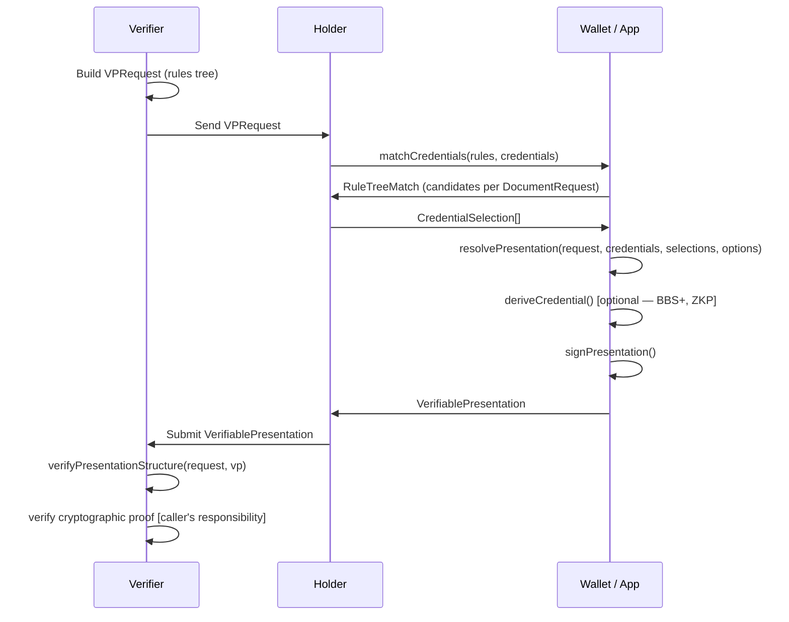
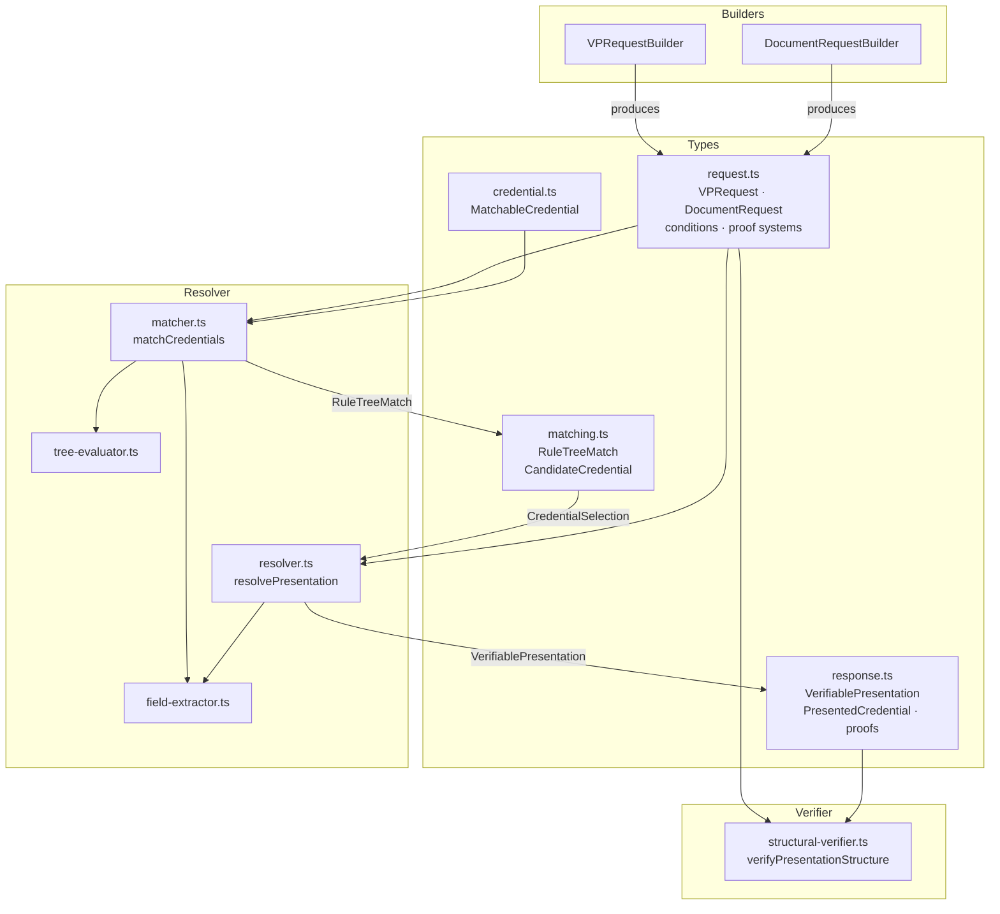
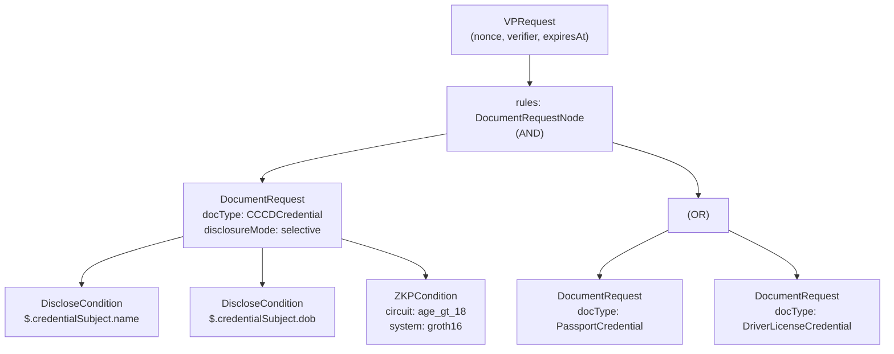
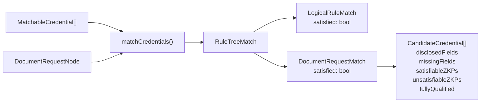
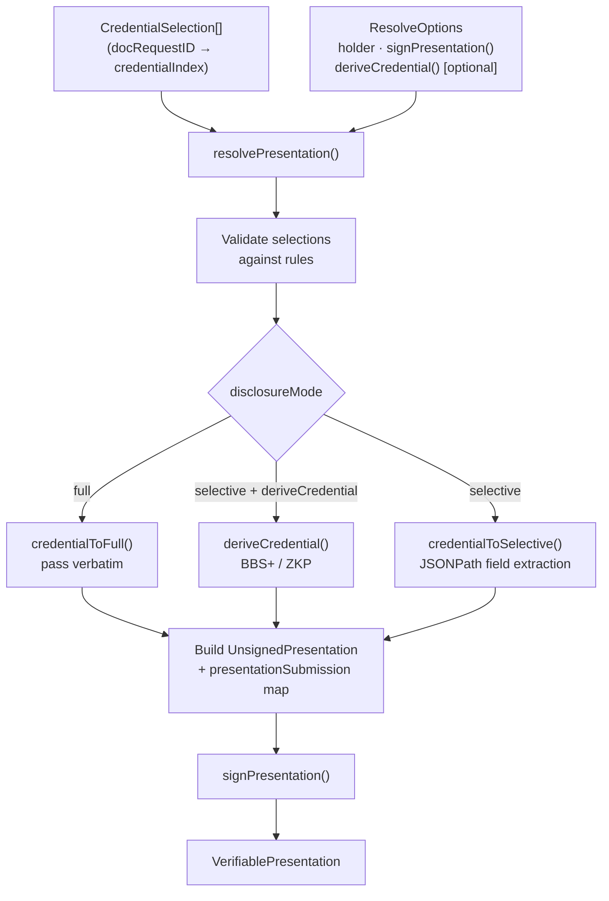

# Presentation Exchange — Design Overview

A library for requesting, matching, assembling, and verifying Verifiable Presentations.
Supports selective disclosure and zero-knowledge proofs over recursive AND/OR rule trees.

---

## System Flow

---

## Architecture

---

## Request Tree Structure

VPRequests use a recursive AND/OR tree of `DocumentRequest` leaf nodes.

---

## Credential Matching

`matchCredentials` evaluates the rules tree against a credential set and produces a mirror tree of match results.

Each `CandidateCredential` filters by:
1. **docType** — credential must have at least one matching type
2. **issuer** — if specified, issuer DID must be in the allowed list
3. **fields** — JSONPath resolution of each `DiscloseCondition`
4. **ZKP inputs** — all `privateInputs` paths must resolve in the credential

---

## Presentation Assembly

---

## Modules

| Module | File | Responsibility |
|---|---|---|
| **Types** | `types/request.ts` | VPRequest, DocumentRequest, condition nodes, proof systems |
| | `types/response.ts` | VerifiablePresentation, PresentedCredential, HolderProof, CredentialProof |
| | `types/matching.ts` | RuleTreeMatch, CandidateCredential, CredentialSelection |
| | `types/credential.ts` | MatchableCredential structural supertype |
| | `types/localization.ts` | LocalizableString for multilingual names/purposes |
| **Builders** | `builder/request-builder.ts` | Fluent API for VPRequest (auto-generates nonce, timestamps) |
| | `builder/document-request-builder.ts` | Fluent API for DocumentRequest with `disclose()` and `zkp()` |
| **Resolver** | `resolver/matcher.ts` | Match credentials to request tree → RuleTreeMatch |
| | `resolver/resolver.ts` | Assemble and sign VerifiablePresentation |
| | `resolver/field-extractor.ts` | Walk condition tree, collect DiscloseConditions and ZKPConditions |
| | `resolver/tree-evaluator.ts` | Generic AND/OR tree evaluator (reusable) |
| **Verifier** | `verifier/structural-verifier.ts` | Validate VP structure against request (nonce, domain, coverage, types) |
| **Utils** | `utils/jsonpath.ts` | Minimal `$.a.b.c` JSONPath resolver |
| | `utils/localization.ts` | Resolve LocalizableString to plain string with language fallback |

---

## Key Design Decisions

**Recursive AND/OR trees** — Both request rules and credential conditions are recursive logical trees, enabling complex multi-credential policies (e.g. "passport AND (CCCD OR driver's license)").

**Disclosure modes** — `selective` extracts only requested fields; `full` passes the credential verbatim. Useful for trusted-verifier flows where no privacy filtering is needed.

**Pluggable derivation** — `deriveCredential` callback decouples the library from any specific selective-disclosure cryptography (BBS+, CL, SD-JWT). The library handles orchestration; the caller provides the crypto.

**Structural verification only** — `verifyPresentationStructure` checks nonce, domain, coverage, and credential types. Cryptographic proof verification is left to the caller to avoid coupling to specific proof suites.

**JSONPath scope** — Only `$.a.b.c` dot-notation is supported. Wildcards, filters, and bracket notation are out of scope.
