# ZKP Domain-Scoped Proof System

## 1. Architecture Overview

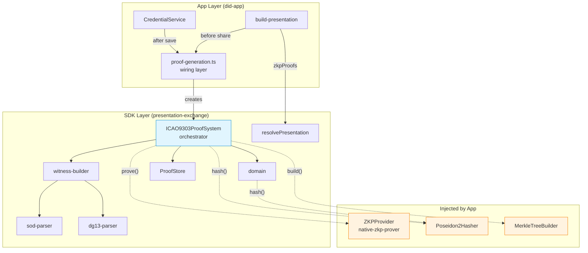

## 2. Proof Chain — Circuit Dependency

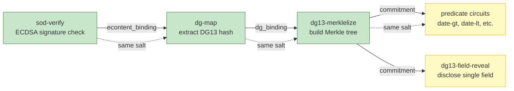

**Chain proofs** (green) are pre-computed at import time.
**On-demand proofs** (yellow) are generated per VP request.

## 3. Credential Import Flow

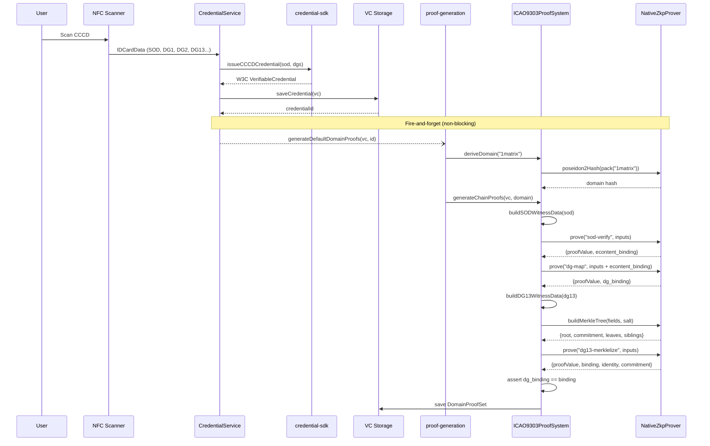

## 4. P2P Sharing Flow (Quick Share — Same Domain)

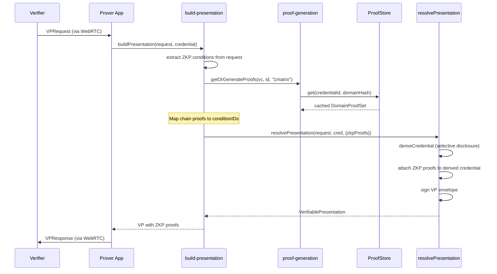

## 5. P2P Sharing Flow (New Domain)

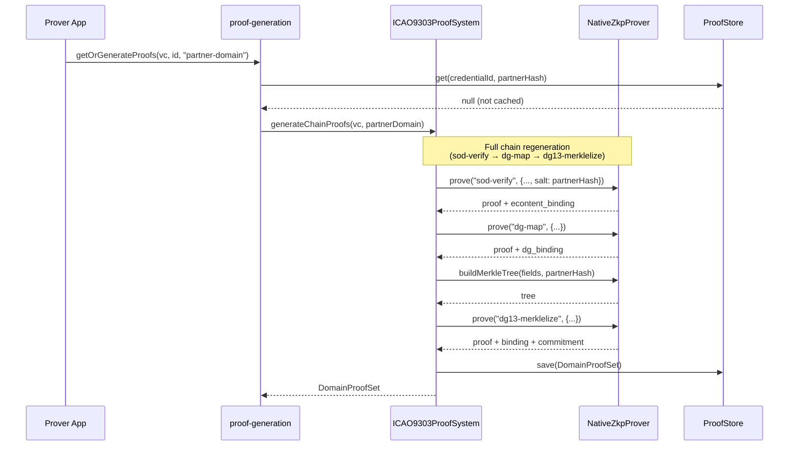

## 6. Data Model — Class Diagram

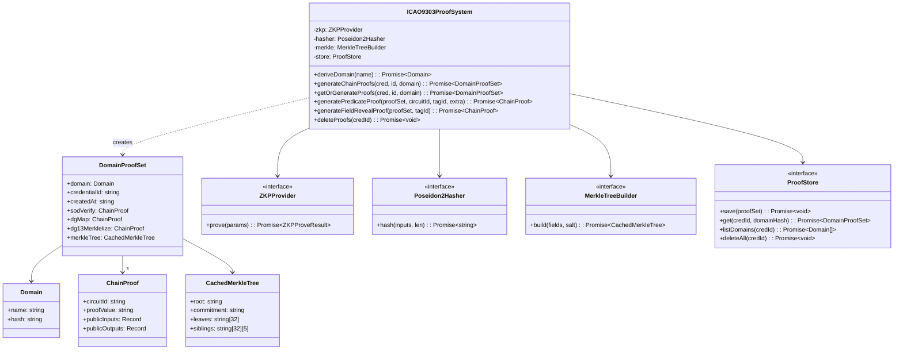

## 7. Module Dependency Graph

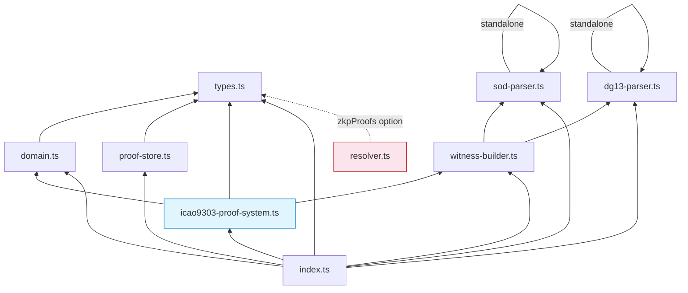

## 8. Binding Chain — Cryptographic Linkage

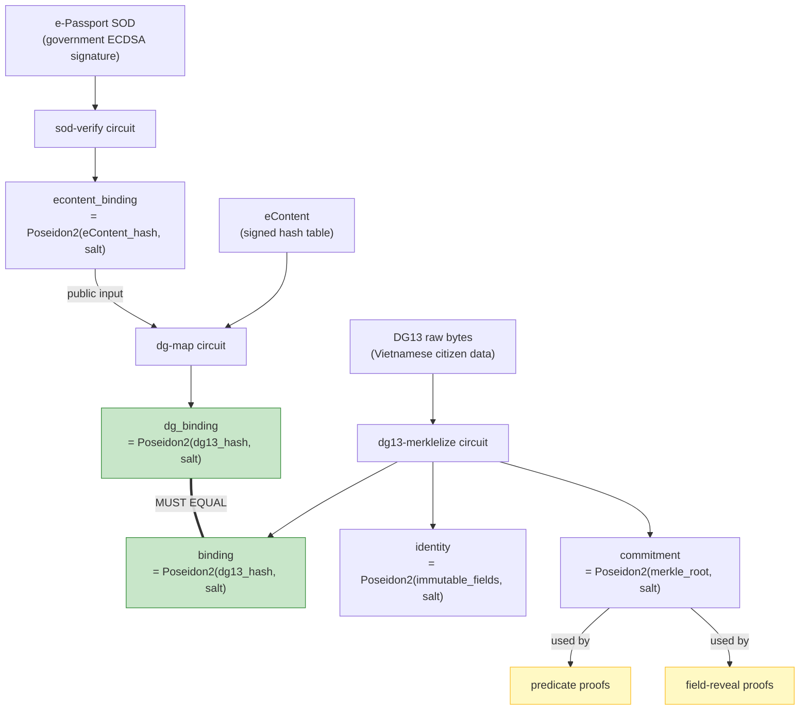

## 9. Storage Layout

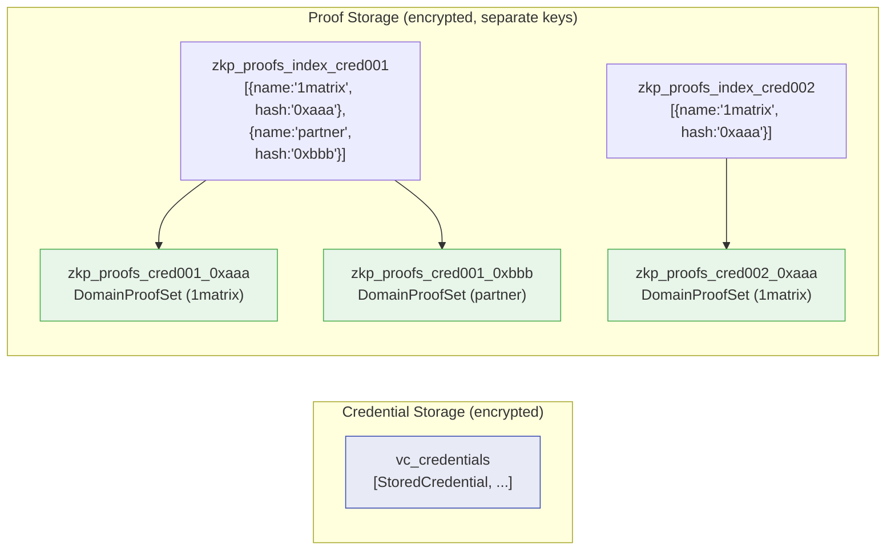

## 10. State Machine — Proof Generation Phases

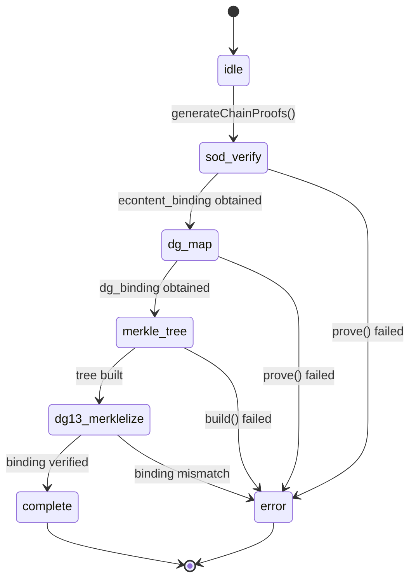

## 11. Domain Unlinkability

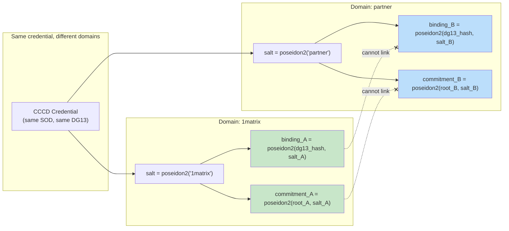

Different domains produce completely different bindings and commitments from the same underlying credential data, making cross-provider tracking impossible.
