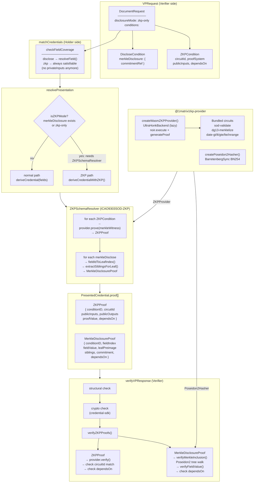

# ZKP Merkle Selective Disclosure

Architecture overview of the ZKP Merkle selective disclosure feature added in `feat/zkp-selective-disclosure`.

---

## Flow Diagram



---

## Key Design Decisions

**`privateInputs` removed from `ZKPCondition`**
Private inputs are never part of the protocol request. The verifier has no business knowing what credential fields feed into a ZKP. Satisfiability is checked at prove time, not match time — `matchCredentials` now marks all ZKP conditions as satisfiable.

**`isZKPMode` only triggers on Merkle conditions**
Plain ZKP predicate conditions (e.g. age proof on a `JsonSchema` credential) do not require a `ZKPSchemaResolver`. Only Merkle disclosure conditions and `zkp-only` mode require it. This keeps non-ICAO schemas working normally alongside ZKP predicates.

**`dependsOn` proof chaining**
Proofs reference each other by `conditionID`. The typical chain for CCCD:
```
sod-validate (ZKPProof)
  └─ dg13-merklelize (ZKPProof, dependsOn: { commitment: "c-sod" })
       └─ fullName (MerkleDisclosureProof, dependsOn: { commitment: "c-dg13" })
       └─ dateOfBirth (MerkleDisclosureProof, dependsOn: { commitment: "c-dg13" })
```
The verifier checks that `commitment` values match across linked proofs, preventing substitution attacks.

**`ZKPProvider` and `Poseidon2Hasher` are injected interfaces**
`presentation-exchange` has no hard dependency on `@aztec/bb.js`. The `@1matrix/zkp-provider` package provides the production implementation; tests use lightweight deterministic stubs.

---

## New Files

| File | Purpose |
|------|---------|
| `src/types/merkle.ts` | `MerkleWitnessData`, `MerkleFieldData`, `MerkleDisclosureProof` |
| `src/types/zkp-provider.ts` | `ZKPProvider`, `ZKPProveParams`, `ZKPVerifyParams`, `Poseidon2Hasher` |
| `src/resolvers/zkp-field-mapping.ts` | DG13 field ID → Merkle leaf index mapping |
| `src/resolvers/zkp-icao-schema-resolver.ts` | `ZKPSchemaResolver`, `createZKPICAOSchemaResolver()` |
| `src/verifier/zkp-verifier.ts` | `verifyZKPProofs()`, `verifyMerkleInclusion()` |
| `packages/zkp-provider/` | Production WASM provider + bundled Noir circuits |


```
const request = new VPRequestBuilder('enrollment')
    .addDocumentRequest(
      new DocumentRequestBuilder('parent', 'CCCDCredential')
        .setSchemaType('ICAO9303SOD')
        .program("program-output-1-var", new ICAO9303ZKPData) -> Will generate a new proof for VP
        .zkp("firstname-reveal-dg13-var", "dg13-profile-disclose")
        .zkp("zk-sod-verification-1", {
          circuitId: "sod-verification",
          privateInputs: {
            // Example
            eContent: "$proof.["ICAO9303SOD"].data", // JSON path to W3C VC
            signature: ""
          },
          publicInputs: {
            // Example
          }
        })
        .run('sod-validate').as('sod')
        .run('icao-merklelize', { dataGroup: 'dg13' }).as('dg13')
        .disclose('c1', 'dg13.fullName')
        .build()
    )
    .addDocumentRequest(
      new DocumentRequestBuilder('child', 'CCCDCredential')
        .setSchemaType('ICAO9303SOD')
        .run('sod-validate').as('sod')
        .run('icao-merklelize', { dataGroup: 'dg13' }).as('dg13')
        .disclose('c2', 'dg13.fullName')
        .zkp('c3', {
          circuitId: 'field-equals',
          fieldId: 'dg13.fatherName',
          publicInputs: {
            ref: 'parent.dg13.fullName',          // ← cross-doc variable
          },
        })
        .build()
    )
    .build();
```